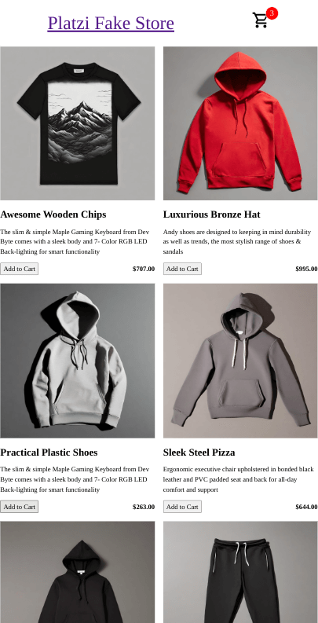
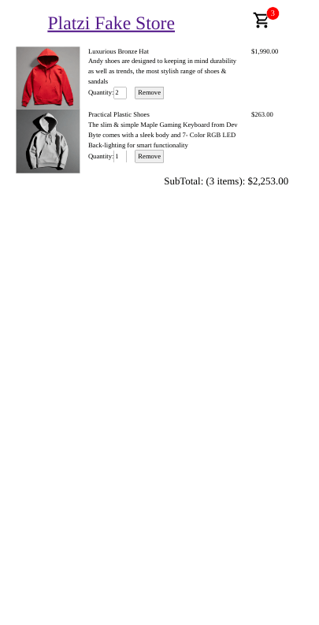

# Odin Project Angular Shopping Cart

[This](https://jdegand.github.io/odin-project-angular-shopping-cart) is an Angular solution for the [Odin Project React shopping cart project](https://www.theodinproject.com/lessons/node-path-react-new-shopping-cart).

## Screenshots

***

***

## Built With

- [Angular](https://angular.dev)
- [Angular CLI](https://github.com/angular/angular-cli) version 17.0.7.
- [Platzi Fake Store API](https://fakeapi.platzi.com/en/rest/products/)
- [Loading.io](https://loading.io/css/)
- [Material Design Icons](https://pictogrammers.com/library/mdi/)

## Thoughts

- Signals seem to be great for shopping carts.  I built this app to test that theory.  
- `mutate` is now `update`.
- `Platzi API` is not great.  The pictures for the items are just random picture links.  The description for the product will never match the image.  The default image size is also quite large at `640px`. The images array has multiple images for a product, but all images are the same size. (UPDATED: Seems like the Platzi API is improving.)
- [Fake Store API](https://fakestoreapi.com/) is a good alternative, but basic updates to the API have not been applied in a year, so I decided to try the Platzi API.  I need to keep looking for better alternatives.  
- Platzi API doesn't have a stock property like the Fake Store API so you have to take extra steps to create a conditional to disable the `Add to Cart` button.    
- I used the offset and limit parameters to limit the amount of products returned.  There are broken image links in some of the products.
- I decided to make the navbar `sticky` so you can see the item count go up in the cart at all times. 
- With the quantity number input, you can click on the input and type in values past the max value and the cart total will increase and the price will re-calculate.  One way to prevent this (at the expense of accessibility) is just returning false on the keydown event.  
- The cart is not persistent.  You could add local storage or use a cookie for persistence.  

## Continued Development

- Testing -> undecided on what library to use
- Pagination -> Platzi API supports it with `offset` and `limit`
- Smaller screens -> truncate Platzi Fake Store to Platzi
- Might add TanStack Query for API request

## Useful Resources

- [transform.tools](https://transform.tools/json-to-typescript) - json to typescript
- [YouTube](https://www.youtube.com/watch?v=kczkl2HndJg) - Using Angular Computed Signals for Cart Totals
- [YouTube](https://www.youtube.com/watch?v=kWDboeL2g4g) - Signals in Angular | How to use Signals in Angular Project | State Management using Angular Signal
- [Stack Overflow](https://stackoverflow.com/questions/5747863/easiest-css-for-red-notification-badge-with-count) - easiest css for red notification badge with count
- [Stack Overflow](https://stackoverflow.com/questions/48406628/bootstrap-align-button-to-the-bottom-of-card) - align button to bottom of card
- [Stack Overflow](https://stackoverflow.com/questions/17164278/disable-writing-in-input-type-number-html5) - disable writing in input type number
- [Medium](https://blog.bitsrc.io/how-to-use-the-truncate-pipe-in-angular-64b01f3c8411) - truncate pipe
- [Blog](https://brianflove.com/2019-09-26/ellipsis-directive/) - Ellipsis Directive
- [Stack Overflow](https://stackoverflow.com/questions/49385369/angular-show-spinner-for-every-http-request-with-very-less-code-changes) - angular show spinner for every http request
- [Stack Overflow](https://stackoverflow.com/questions/49403895/angular-currency-pipe-no-decimal-value) - currency pipe no decimal value
